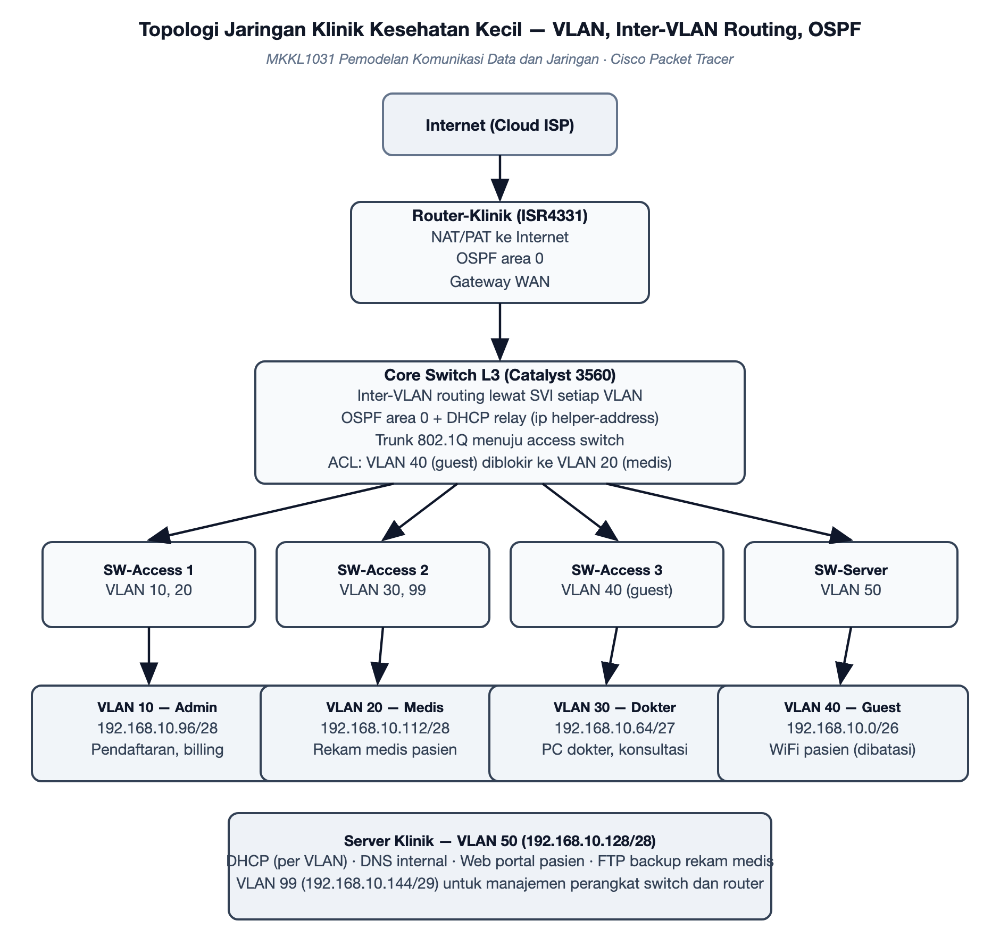

# Rencana Proyek — Jaringan Klinik Kesehatan Kecil — Segmentasi VLAN, Inter-VLAN Routing, OSPF, dan Layanan Server

**Mata kuliah:** Pemodelan Komunikasi Data dan Jaringan (MKKL1031) · Semester 7  
**Program Studi Ilmu Komputer — Fakultas Sains, Teknologi dan Ilmu Kesehatan, Universitas Bina Bangsa Getsempena**  
**Dosen Pengampu:** Ahmad Mujahid Abdurrahman, S.Kom, M.T.  
**Versi:** 1.0 — 19 September 2026

> Salinan kerja dari dokumen rencana proyek pada Google Docs. Perubahan wajib dilakukan pada kedua tempat agar penilaian tetap sinkron.

## 1. Identitas Kelompok

| No | Nama | NIM | Peran dalam Proyek |
|---|---|---|---|
| 1 | Yogi Prasetya Sadewa | 23210060 | Ketua kelompok; perancangan topologi, skema pengalamatan VLSM, dan konfigurasi routing |
| 2 | Asmarudin | 23210133 | Konfigurasi VLAN dan inter-VLAN routing pada core switch L3 |
| 3 | Deski Taiza | 23210003 | Konfigurasi layanan server: DHCP, DNS, web, dan FTP |
| 4 | Akhsanul Taqwim | 23210006 | Penerapan ACL pemisahan akses jaringan tamu dengan jaringan medis |
| 5 | Wira | 23210045 | Pengujian konektivitas dan penyusunan tabel bukti pengujian |
| 6 | Abadi | 23210004 | Perancangan dan pengujian skenario jalur cadangan (routing dinamis) |
| 7 | Ferdyan Ardhani | 23210039 | Penyusunan tabel pengalamatan VLSM dan validasinya terhadap simulasi |
| 8 | Muhammad Iqbal | 23210142 | Pengujian pembatasan akses dari sisi tamu maupun dari sisi medis |
| 9 | Meriandi Wahyu Kurniawan | [NIM] | Dokumentasi, README, dan pengelolaan repository |

## 2. Masalah dan Tujuan

### Masalah yang diselesaikan

Klinik kesehatan menyimpan data rekam medis yang bersifat rahasia, namun jaringan pada klinik kecil sering dibangun seadanya: satu jaringan datar untuk semua perangkat, mulai dari komputer pendaftaran, komputer dokter, sampai WiFi yang dipakai pasien. Akibatnya, perangkat tamu berada pada jaringan yang sama dengan komputer yang menyimpan data medis, sehingga satu perangkat tamu yang terinfeksi dapat menjangkau data pasien. Proyek ini merancang dan menguji jaringan klinik satu lantai yang memisahkan setiap zona ke dalam VLAN tersendiri, menerapkan routing antar-VLAN, membatasi akses jaringan tamu ke jaringan medis, serta menyediakan layanan pendukung berupa DHCP, DNS, portal web, dan server berkas untuk pencadangan.

### Latar belakang

- Rancangan ini disusun sebagai simulasi yang dapat dijalankan dan diuji, bukan sekadar gambar topologi.
- Data rekam medis tergolong data pribadi yang dilindungi, sehingga pemisahan jaringan antara zona publik dan zona medis menjadi kebutuhan dasar, bukan tambahan.
- Belum ada rancangan jaringan klinik yang menjadi acuan pada lingkup Prodi Ilmu Komputer, sehingga hasil proyek ini dapat dipakai sebagai bahan pembelajaran.

### Pengguna sasaran

- Pengelola klinik kecil, sebagai gambaran jaringan yang dapat diterapkan dengan perangkat terjangkau.
- Dosen dan mahasiswa, sebagai bahan pembelajaran perancangan VLAN, routing, dan pembatasan akses.

### Batasan lingkup

- Simulasi dibatasi pada satu gedung klinik satu lantai dengan enam zona jaringan.
- Perangkat yang dipakai pada simulasi adalah router dan switch lapis tiga yang tersedia pada perangkat lunak simulasi.
- Lingkup pengujian mencakup konektivitas antar-VLAN, pembatasan akses jaringan tamu, dan pengujian empat layanan server.
- Aspek di luar jangkauan simulasi — seperti kekuatan sinyal WiFi sesungguhnya dan perangkat keras fisik — dibahas sebagai catatan penerapan, bukan sebagai hasil pengujian.

### Tujuan proyek

1. Merancang dan mensimulasikan jaringan klinik yang membagi setiap zona ke dalam VLAN tersendiri beserta skema pengalamatan VLSM yang lengkap.
2. Menerapkan inter-VLAN routing dan dynamic routing antar-perangkat, serta membatasi akses dari jaringan tamu menuju jaringan medis.
3. Menguji konektivitas antar-VLAN dan empat layanan server, lalu melaporkan hasilnya beserta bukti pengujian.

## 3. Arsitektur Sistem

*Gambar 1. Topologi jaringan klinik: router, core switch L3, access switch per zona, dan layanan server.*

### Komponen utama

- Router klinik: menghubungkan jaringan lokal ke internet dengan terjemahan alamat, sekaligus ikut serta dalam routing dinamis.
- Core switch lapis tiga: menjadi pusat routing antar-VLAN, menjalankan routing dinamis, dan meneruskan permintaan alamat otomatis ke server.
- Empat access switch: menghubungkan perangkat pada setiap zona ke core switch melalui jalur trunk.
- Layanan server: pengalamatan otomatis per VLAN, penamaan internal, portal web internal, dan server berkas untuk pencadangan rekam medis.
- VLAN manajemen: jalur khusus untuk mengelola perangkat jaringan, terpisah dari VLAN pengguna.

### Alur data dan protokol

- Setiap perangkat pada zona klinik memperoleh alamat secara otomatis dari server melalui perantara core switch, sesuai VLAN tempat port terpasang.
- Komunikasi antar-VLAN melewati antarmuka virtual pada core switch, bukan langsung antar-perangkat, sehingga aturan pembatasan akses dapat diterapkan di titik itu.
- Aturan pembatasan memblokir seluruh akses dari VLAN tamu menuju VLAN medis dan VLAN manajemen, namun tetap mengizinkan akses menuju internet.
- Router dan core switch bertukar informasi rute secara dinamis sehingga jalur menuju internet dan antar-jaringan dapat berpindah bila satu jalur bermasalah.
- Setiap permintaan nama host internal diselesaikan oleh server penamaan, dan akses portal web serta server berkas diuji dari perangkat pada VLAN yang berhak.

## 4. Tools dan Lingkungan

- Perangkat lunak simulasi: Cisco Packet Tracer, dengan berkas simulasi disimpan pada repository.
- Perangkat yang dimodelkan: satu router, satu switch lapis tiga, empat switch akses, dan satu server layanan.
- Skema pengalamatan: VLSM dengan tabel alamat jaringan, alamat broadcast, dan rentang host untuk setiap VLAN.
- Layanan yang diuji: DHCP, DNS, web, dan FTP.
- Perkakas pembanding: Mininet atau GNS3 sebagai alternatif bila berkas simulasi perlu dijalankan pada lingkungan lain.
- Kolaborasi: GitHub untuk berkas simulasi dan dokumentasi, Google Docs untuk rencana proyek, serta Issues untuk pembagian tugas.

## 5. Rencana Pencapaian UTS (Pertemuan 8)

*Target ini menjadi acuan penilaian: capaian kelompok pada Pertemuan 8 dibandingkan dengan janji berikut.*

| Bagian yang dijanjikan selesai | Bentuk bukti pada Pertemuan 8 | Penanggung jawab |
|---|---|---|
| Topologi dasar terbentuk dan seluruh VLAN dikonfigurasi pada switch | Berkas simulasi yang dapat dijalankan dan daftar VLAN beserta port anggotanya | Asmarudin |
| Skema pengalamatan VLSM lengkap beserta tabel alamat jaringan, broadcast, dan rentang host | Dokumen tabel pengalamatan yang cocok dengan konfigurasi pada simulasi | Yogi Prasetya Sadewa |
| Perangkat pada setiap VLAN memperoleh alamat otomatis dari server | Tabel hasil pembacaan alamat pada perangkat dari setiap VLAN | Deski Taiza |
| Komunikasi antar-VLAN berjalan melalui core switch | Bukti pengujian konektivitas antar-VLAN beserta jalur yang dilalui | Asmarudin |
| Pembatasan akses dari jaringan tamu menuju jaringan medis berjalan | Bukti pengujian yang memperlihatkan akses tamu ditolak dan akses lain tetap berjalan | Akhsanul Taqwim |
| Tabel pengalamatan VLSM dicocokkan ulang dengan konfigurasi pada simulasi | Dokumen tabel pengalamatan versi terkoreksi beserta catatan pemeriksaan | Abadi |
| Jalur cadangan diuji dengan memutus satu jalur penghubung | Hasil pemeriksaan jalur sebelum dan sesudah satu jalur diputus | Ferdyan Ardhani |
| Repository aktif: berkas simulasi, dokumentasi, dan riwayat commit | Riwayat commit mingguan dan tautan repository | Meriandi Wahyu Kurniawan |

## 6. Rencana Pencapaian UAS (Pertemuan 16) dan Skenario Demonstrasi

### Definisi produk akhir

- Model jaringan klinik yang lengkap dan dapat dijalankan pada perangkat lunak simulasi, tersimpan pada repository.
- Dokumentasi lengkap: tabel pengalamatan, konfigurasi setiap perangkat, diagram topologi, dan laporan hasil pengujian.
- Analisis pemisahan jaringan sebagai upaya perlindungan data medis, beserta catatan penerapan pada perangkat nyata.

### Skenario demonstrasi

1. Membuka berkas simulasi dan memperlihatkan seluruh VLAN beserta anggotanya.
2. Menjalankan pengujian konektivitas dari perangkat pada setiap VLAN menuju gerbang dan server.
3. Memperlihatkan perangkat tamu berhasil mengakses internet namun ditolak saat menuju jaringan medis.
4. Menguji keempat layanan server: pengalamatan otomatis, penamaan internal, portal web, dan transfer berkas.
5. Memutus salah satu jalur dan memperlihatkan routing dinamis memindahkan jalur komunikasi.
6. Menyajikan tabel pengalamatan VLSM dan catatan penerapan pada perangkat nyata sebagai temuan utama.
7. Setiap anggota menjelaskan modul yang dikerjakannya, dipilih langsung oleh dosen.

## 7. Pembagian Kerja per Minggu

| Minggu | Kegiatan utama | Luaran |
|---|---|---|
| Ke-2 | Finalisasi rencana, penetapan jumlah zona, dan penyiapan repository | Rencana proyek dan repository siap |
| Ke-3 | Perancangan topologi dan perhitungan VLSM untuk seluruh VLAN | Tabel pengalamatan lengkap |
| Ke-4 | Konfigurasi VLAN dan trunk pada core switch serta access switch | VLAN aktif dan terhubung ke core switch |
| Ke-5 | Konfigurasi inter-VLAN routing, routing dinamis, dan layanan pengalamatan otomatis | Konektivitas antar-VLAN berjalan |
| Ke-6 | Konfigurasi layanan server: penamaan, portal web, dan server berkas | Empat layanan server dapat diakses |
| Ke-7 | Penerapan dan pengujian pembatasan akses, penyusunan bahan UTS | Bukti pengujian pembatasan akses dan bahan UTS lengkap |
| Ke-8 | Pembahasan progres UTS dan tindak lanjut catatan dosen | Catatan perbaikan dan rencana revisi |
| Ke-9 s.d. 15 | Pengujian menyeluruh, pengujian jalur cadangan, dan penyusunan laporan akhir | Data lengkap dan laporan pengujian |
| Ke-16 | Presentasi dan demonstrasi produk akhir | Produk akhir dan laporan final |

## 8. Risiko dan Rencana Cadangan

| Risiko | Rencana cadangan |
|---|---|
| Perangkat lunak simulasi tidak dapat dijalankan pada perangkat anggota karena keterbatasan spesifikasi | Gunakan satu perangkat sebagai lingkungan utama, dan simpan berkas simulasi beserta tangkapan proses pengujian agar dapat diperlihatkan anggota lain. |
| Konfigurasi pembatasan akses ikut memblokir layanan yang seharusnya boleh diakses tamu | Susun aturan secara berurutan mulai dari yang paling khusus, lalu uji satu per satu dari setiap VLAN dan catat hasilnya. |
| Routing dinamis tidak bertukar informasi karena ketidakcocokan pengaturan antarmuka | Pastikan kedua perangkat berada pada area yang sama, periksa status ketetanggaan, dan cocokkan pengaturan antarmuka pada jalur penghubung. |
| Perbedaan versi perangkat lunak simulasi antar-anggota menyebabkan berkas tidak terbuka | Kunci versi yang dipakai pada README, dan ekspor diagram topologi sebagai gambar agar tetap dapat diperlihatkan. |
| Anggota tidak aktif sehingga jadwal meleset | Setiap bagian memiliki penanggung jawab cadangan; ketua melaporkan kondisi ini pada sesi progres kepada dosen. |

## 9. Riwayat dan Pembaruan Dokumen

Versi 1.0 — 19 September 2026: dokumen awal disusun setelah penetapan topik, memuat rencana pencapaian UTS, rencana pencapaian UAS, pembagian kerja per minggu, serta risiko dan rencana cadangan. Dokumen ini maksimal empat halaman dan diperbarui pada setiap sesi pembahasan progres mingguan.

- `19 September 2026` — v1.0 dokumen awal dibuat.